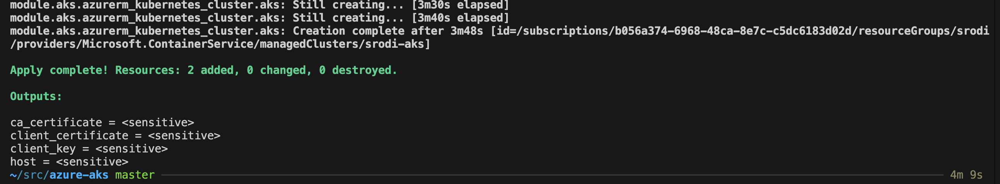

# Azure Kubernetes Service (AKS) Deployment with OpenTofu

This project sets up an Azure Kubernetes Service (AKS) cluster using OpenTofu. OpenTofu is an open-source infrastructure as code tool that allows you to define and provision infrastructure using a high-level configuration language. For more information on OpenTofu and installation instructions, visit the [official documentation](https://opentofu.org/docs).



## Testing flow

In this example, I use Terratest to deploy an AKS cluster with OpenTofu and verify its functionality. The high-level flow is represented in this diagram.


## Prerequisites

- OpenTofu installed on your machine. Follow the [installation guide](https://opentofu.org/docs/intro/install/) to set it up.
- Azure CLI installed and authenticated.

### Create `terraform.tfvars`

Create a `terraform.tfvars` file in the [examples/aks](./examples/aks) and [live/aks](./live/aks) directories of the project. This is required by the provider to authenticate to Azure. Below is an example of what this file might look like:

```hcl
subscription_id     = "your-subscription-id"
tenant_id           = "your-tenant-id"
```

### Available Commands

### init

Initializes the project by setting up the necessary providers and backend configuration.

```sh
make init
```

This command runs tofu init in the aks directory.

### plan
Generates an execution plan for the project, showing what changes will be made without actually applying them.

```sh
make plan
```

This command runs tofu plan in the aks directory.

### apply
Applies the changes and creates the resources as defined in the configuration files.

```sh
make apply
```

This command runs tofu apply in the aks directory.

### destroy
Destroys the resources created by the project.

```sh
make destroy
```

This command runs tofu destroy in the aks directory.

### fmt
Formats the configuration files to ensure they follow the standard style.

```sh
make fmt
```

This command runs tofu fmt -recursive to format all configuration files recursively.

### test
Runs the tests to validate the infrastructure and its outputs.

```sh
make test
```

This command runs go test -v ./... in the test directory.